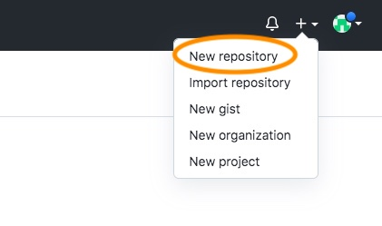
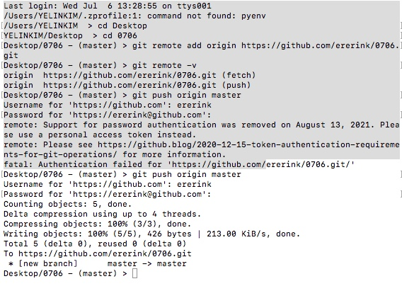

# 로컬 - 원격 저장소 만들고 연결하기


### 로컬 저장소란?

* 자신의 컴퓨터에 파일이 저장되는 개인 전용 저장소이다. 
* 쉽게 말해 '내 컴퓨터' 이며, 이는 GitHub의 원격저장소와 연결하여 버전 관리를 할 수 있다. 


### in 로컬 저장소

#### 1. 로컬 저장소에 git 저장소를 만든다.

```python
$ git init
	...
```


#### 2. 커밋을 한다. 

```python
$ git add . 
$ git commit -m 'Memo'
```


#### 3. git log, status를 통해 중간중간 계속해서 폴더/파일들의 상태를 확인한다.

```python
$ git log
$ git status
...
```


------------


### in 원격 저장소

#### 1. GitHub에서 원격 저장소를 만든다. 



#### 2. 원격저장소 경로를 설정한다.

* 원격 저장소와 로컬 저장소를 연결해준다.

```python
$ git remote add origin https://github.com/username/repositoryname.git
```


#### 3. 원격 저장소 정보를 확인한다.

```python
$ git remote -v
origin https://github.com/username/repositoryname.git
origin https://github.com/username/repositoryname.git
```

* origin은 원격저장소 이름이다. 


#### 4. 원격 저장소에 변경사항을 올린다.

```python
$ git push origin master
```


-----

## 실습 실수 기록

위 내용을 바탕으로 실습하며 겪은 실수를 기록해봤다. 



### 오류 1. 디렉토리 위치 

초반에 desktop도 아닌 곳에서 `git remote add origin ~` 을 했더니 오류가 뜨며 헤맸다. 

`cd Desktop` `cd 0706(연습파일)` 로 제대로 찾아 가니 원격저장소(깃헙)과 제대로 연결되었다. 

이후 `git push orgin master` 명령으로 Github 로그인을 하였다. 

명령 시 **현재 디렉토리의 주소, 위치 잘 파악하고 있어야 한다.**


