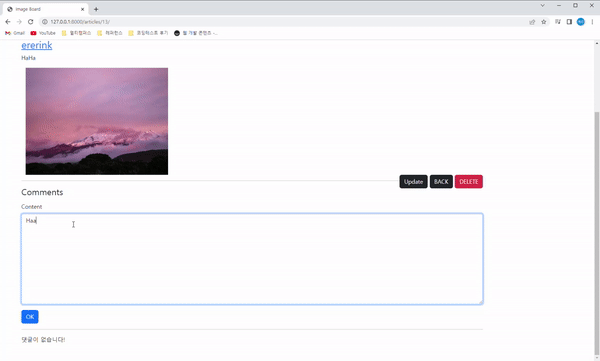

# 주요기능

## 게시물 및 댓글 작성자 나타내기

게시물 작성자를 누르면 작성자가 작성한 게시물과 댓글 목록을 볼 수 있습니다. 
게시물과 댓글을 누르면 해당 게시물과 댓글 페이지로 이동합니다. 

## 이미지 게시물 생성

## 이미지 게시물 수정

## 댓글 및 게시물 삭제

## 목표
1. ModelForm을 활용한 CRUD 기능 구현
2. Django Model 1 : N 관계에 대해 이해하고, 코드 상에서 두 모델 매핑하기
3. Django Auth를 활용한 회원 관리 기능 개발에 대한 흐름 파악 및 개발
4. 로그인 상태에 따라 컴포넌트 출력 및 기능 제한
+ Django Auth를 활용한 회원 관리, Django Media를 활용한 이미지 업로드

## 요구사항

### 모델 Model

- 모델 이름 : Article

| 필드 이름 | 역할 | 필드 | 속성 |
| --- | --- | --- | --- |
| title | 글 제목 | Char |  |
| content | 글 내용 | Text |  |
| image | 글 이미지 | Image |  |
| thumbnail | 썸네일 이미지 | ProcessedImage |  |

- 모델 이름 : Comment

| 필드 이름 | 역할 | 필드 | 속성 |
| --- | --- | --- | --- |
| article | 참조 게시글 | ForeignKey | on_delete=models.CASCADE |
| content | 댓글 내용 | Char | max_length=80 |

### **폼 Form**

회원가입

- Django 내장 회원가입 폼 UserCreationForm을 상속 받아서 **CustomUserCreationForm** 작성&활용
    
    해당 폼은 아래 필드만 출력합니다.
    
    - username
    - password1
    - password2

로그인

- Django 내장 로그인 폼 **AuthenticationForm 활용**

회원 정보 수정

- Django 내장 폼 UserChangeForm을 상속 받아서 **CustomUserChangeForm** 작성&활용
    
    해당 폼은 아래 필드만 출력합니다.
    
    - first_name
    - last_name
    - email

### 기능 View

#### 회원가입

- `POST` http://127.0.0.1:8000/accounts/signup/
- CustomUserCreationForm을 활용해서 회원가입 구현

회원 목록 조회

- `GET` http://127.0.0.1:8000/accounts/

회원 정보 조회

- `GET` http://127.0.0.1:8000/accounts/<user_pk>/

로그인

- `POST` http://127.0.0.1:8000/accounts/login/
- **AuthenticationForm**를 활용해서 로그인 구현

로그아웃

- `POST` http://127.0.0.1:8000/accounts/logout/

회원 정보 수정

- `POST` http://127.0.0.1:8000/accounts/<user_pk>/update/
- **CustomUserChangeForm**를 활용해서 회원 정보 수정 구현

#### 게시판

게시글 목록 조회

- `GET` http://127.0.0.1:8000/articles/

게시글 정보 조회

- `GET` http://127.0.0.1:8000/articles/<int:article_pk>/
- 해당 게시글(article_pk)에 작성된 댓글 목록 조회

게시글 생성

- `POST` http://127.0.0.1:8000/articles[/](http://127.0.0.1:8000/posts/create/)create[/](http://127.0.0.1:8000/posts/create/)

게시글 수정

- `POST` http://127.0.0.1:8000/articles/<int:pk>/update/

게시글 삭제

- `POST` http://127.0.0.1:8000/articles/<int:pk>/delete/

#### 이미지 업로드

데이터 목록 조회

- `GET` http://127.0.0.1:8000/articles/

데이터 정보 조회

- `GET` http://127.0.0.1:8000/articles/<int:pk>/

데이터 생성

- `POST` http://127.0.0.1:8000/articles/create/
- 사용자가 글 이미지 `image`와 썸네일 이미지 `thumbnail` 를 업로드할 수 있습니다.

데이터 수정

- `POST` http://127.0.0.1:8000/articles/<int:pk>/update/

#### 댓글

게시글에 작성된 댓글 목록 조회

- `GET` http://127.0.0.1:8000/article**s**/<int:article_pk>/
- 해당 게시글(article_pk)의 댓글 목록 조회

댓글 생성

- `POST` http://127.0.0.1:8000/article**s**/<int:article_pk>/comments/

### 화면 Template

네비게이션바, Bootstrap <nav>

- 로그인 상태에 따라 다른 화면 출력
    1. 로그인 상태
        - 로그인 한 사용자의 Username 출력
            - Username을 클릭하면 회원 조회 페이지로 이동
        - 로그아웃 버튼
    2. 비 로그인 상태
        - 로그인 페이지 이동 버튼
        - 회원가입 페이지 이동 버튼

로그인 페이지

- `GET` http://127.0.0.1:8000/accounts/login/
- 로그인 폼
- 회원가입 페이지 이동 버튼

회원가입 페이지

- `GET` http://127.0.0.1:8000/accounts/signup/
- 회원가입 폼

회원 목록 페이지

- `GET` http://127.0.0.1:8000/accounts/
- 회원 목록 출력
- 회원 아이디를 클릭하면 해당 회원 조회 페이지로 이동

회원 조회 페이지(프로필 페이지)

- `GET` http://127.0.0.1:8000/accounts/<user_pk>/

회원 정보 수정 페이지

- `GET` http://127.0.0.1:8000/accounts/<user_pk>/update/

목록 페이지

- `GET` http://127.0.0.1:8000/article**s**/
- 게시글 목록
- 썸네일 이미지 `thumbnail`가 있으면 썸네일 이미지를 출력합니다.

정보 페이지

- `GET` http://127.0.0.1:8000/article**s**/<int:pk>/
- 해당 게시글 정보 출력
    - 글 이미지 `image` 가 있으면 이미지를 출력합니다.

작성 페이지

- `GET` http://127.0.0.1:8000/article**s**/create/
- 게시글 작성 폼
    - 사용자가 이미지를 업로드할 수 있어야합니다.

수정 페이지

- `GET` http://127.0.0.1:8000/article**s**/<int:pk>/update/
- 게시글 수정 폼