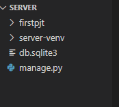

# Django 개발 환경 설정 가이드


0. 현재 위치 경로 파악하기

```bash
$ pwd
/c/Users/yelki
```


1. 서버 환경을 만들어 줄 폴더 만들기 

```bash
$ mkdir server
```

폴더명이 'server' 라는 폴더를 만들어주었다. 


2. 해당(server)폴더로 이동하여 현재 어떤 패키지가 깔려있는지 확인한다.

```bash
$ cd server
$ pip list

Package            Version
------------------ ---------
...                ...
```


3. 해당 폴더에 가상환경을 만들어준다. 

```bash
$ python -m venv server-venv
```

server 폴더의 가상환경을 만들어주었다. 

이 가상환경의 범위는 server 폴더이며, 해당 폴더 범위 밖의 환경에는 가상환경이 존재하지 않는다. 


4. 해당 폴더의 폴더 및 파일을 확인하며 가상환경 구축이 제대로 실행되었는지 확인한다. 

```bash
$ ls -a
./ ../ server-venv/
```


5. 해당 폴더에 구축된 가상환경을 실행시켜준다. 

```bash
$ source server-venv/Scripts/activate
(server-venv)
```

(server-venv)가 bash창에 뜬다면 가상환경이 실행되고 있는 것이다. 


6. Django를 설치한다.

```bash
$ pip install django==3.2.13

Collecting django==3.2.13
 Downloading Django-3.2.13-py3-none-any.whl (7.9 MB)
 ...
```

Django는 현재 4.1.1 버전이 나왔지만 상용된 기간이 비교적 긴 3.2.13을 사용한다. 


7. 제대로 설치가 되었는지 설치 목록을 확인한다. 

```bash
$ pip list
Package    Version
--------   ----------
...         ...
Django      3.2.13
```


8. 프로젝트를 시작하기 위해 프로젝트를 생성한다.

```bash
$ django-admin startproject firstpjt
```

Django의 관리자를 불러서 'firstpjt'라는 프로젝트를 시작하겠다고 명령한다. 


9. 프로젝트 생성이 되었는지 확인한다. 

```bash
$ ls

firstpjt/ manage.py   server-venv/
(server-venv)
```


10. 현재 위치에서 vscode창 열어서 확인하기

```bash
$ code .
```



server 폴더 안에 fistpjt(프로젝트), server-venv(가상환경), sql 파일, manage 파일이 생성되었다. 


11. 서버를 실행시킨다. 

```bash
$ python manage.py runserver
```

서버를 실행시키기 위해서 manage.py을 실행시켜야한다. 


localhost:8000을 주소창에 입력하면 Django 서버가 성공적으로 실행된 것을 확인할 수 있다!
