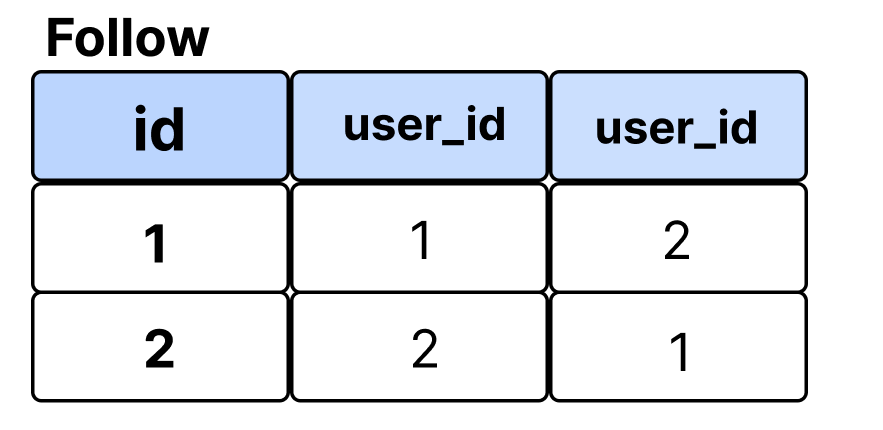

# Follow 기능 구현

인스타그램이나 트위터에서 사용자가 다른 사용자를 follow하는 기능을 구현해보자!


## Follow 기능에서의 symmetrical

symmetrical의 의미는 `대칭`이다. 

이를 Follow 기능에서 빗대어 설명하자면,

두 사용자 모두 서로를 팔로우하고 있는 상황이라면, '내가 너를 팔로우 한다면, 너도 나를 팔로우한다.' 를 의미한다. 

즉, 두 사용자가 대칭처럼 똑같이 팔로우를 하고 있는 상황이다. (맞팔)


이를 데이터베이스 관점에서 본다면, 

A가 B에게 친구 요청(팔로잉)을 하였고, B입장에서 B의 팔로워로 A가 등록된다.


* `symeertical=False` 인 경우



id 1과 2가 서로 팔로우하는 상황이라면 이러한 형식으로 데이터베이스에 Follow 정보가 들어가게 된다. 


* `symmetrical=True` 인 경우


기본적으로 symmetrical이 True이라면 싸이월드의 일촌같은 개념으로 봐야한다. 

즉, 팔로우 신청을 하였고, 팔로우 신청을 받아준다면 두 사용자는 자동적으로 서로 팔로우를 하게 되는 것이다. 

그러므로 데이터베이스에는 하나의 데이터만 존재하면 되는 것이다. 


# 

## 로직

1. 사용자 프로필 페이지에 들어가서

2. 'Follow'를 누르면 추가되고, (add)

3. 이미 팔로우 상태이면 팔로우 취소 버튼을 누르면 삭제된다. (remove)

        => 좋아요 기능과 유사하다.

* 팔로우/취소 요청할 때 url
  
  * accounts/<int:pk >/follow/

* 처리 완료 후 프로필 페이지로 redirect

* 셀프 좋아요는 허용하지만, 셀프 팔로우는 허용할 수 없다.

# 구현

## 1. accounts/models.py 설정

```python
class User(AbstractUser):
    followings = models.ManyToManyField('self', symmetrical=False, related_name='followers')
```

`self`와 `symmetrical`을 설정한다. 

이때 팔로우 상대의 두 사용자가 서로 팔로우해야 하는 상황을 만들어주기 위해 `symmetrical=False` 으로 설정한다. 

## 2. accounts/urls.py 설정

```python
# accounts/urls.py
urlpatterns = [
    ...,
     path('<int:user_pk>/follow/', views.follow, name='follow'),
]
```

## 3. accounts/views.py 설정

```python
# accounts/views.py

def follow(request, pk):
    user = get_object_or_404(get_user_model(), pk=pk)

    if request.user == user:
        messages.warning(request, '스스로 팔로우 할 수 없습니다.')
        return redirect('accounts:detail', pk)  

    if request.user in user.followers.all():
    # (이미) 팔로우 상태이면, '팔로우 취소'버튼을 누르면 삭제 (remove)
        user.followers.remove(request.user)   

    else:
    # 팔로우 상태가 아니면, '팔로우'를 누르면 추가 (add)
        user.followers.add(request.user)  

    return redirect('accounts:detail', pk)
```

`get_user_model()`로 User calss를 가져와서 user에 할당한다. 

만약 요청한 user값이 자기 자신이라면 경고 메세지를 띄워준다. 

그리고 해당 유저의 detail 페이지로 넘겨준다. 

만약 요청한 유저 정보가 `followers` (models.py에 정의한 followings의 related_name)에 존재한다면,

즉, 이미 팔로우한 유저라면 팔로우를 취소할 수 있도록 `remove(request.user)`를 설정한다. 

만약 팔로우 상태가 아니라면 팔로우를 할 수 있도록 추가 (`add`) 할 수 있게 한다. 

위 조건문을 실행한 후 `redirect`로 해당 유저(pk)의 detail 페이지로 이동시킨다. 

## 4. accounts/detail.html 설정

```python
<!-- accounts/detail.html -->

<h1>{{ user.username }}님의 프로필</h1>
...
<p>팔로우 : {{ user.followings.count }} | 팔로워 : {{ user.followers.count }}</p>



<a href="">
    
        팔로우 취소
    
        팔로우
    
</a>

```

``: 스스로 팔로우하지 않도록 설정한 if문. 

`{% if request.user in user.followers.all` : 이미 팔로우한 사용자라면 '팔로우 취소' 를 띄우고

` 팔로우` : 아니라면 '팔로우'를 띄운다. 
