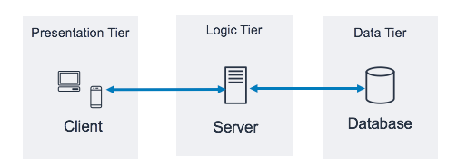

# 서버 기초

**Q. IP와 도메인은 무엇일까요?**

컴퓨터에 메세지를 보내기 위해 메세지를 받을 특정 컴퓨터를 지정해야 한다. 

특정 컴퓨터를 지정하여 메세지를 보내기 위해서는 각 컴퓨터마다 고유한 주소가 필요하다.

IP 주소는 각 컴퓨터에 고유한 주소를 부여하는 역할을 한다. 

IP 주소의 형식은 '196.986.2.10' 와 같다. 

'google.com'과 같이 도메인 주소는 IP주소를 사람이 읽을 수 있도록 한 형태이다. 

**Q. 클라이언트와 서버는 무엇일까요?**

* 클라이언트
  
  다른 프로그램에게 서비스를 요청하는 프로그램이다. 
  
  즉, 웹 페이지나 파일의 전송을 요구한다. 
  
  

* 서버

        클라이언트의 요청에 대해 응답해주는 프로그램이다 

예를 들어, 누군가가 자신의 은행 계좌 내역을 조회하려는 경우, 자신의 컴퓨터에 있는 클라이언트 프로그램이 은행에 위치한 거래 서버에 요구사항을 전송하게 된다.

거래 서버는 계좌내역을 검색하는 데이터베이스 서버에 요구사항을 보내게 된다. 요청을 받은 데이터베이스 서버가 계좌내역을 탐색하고 해당 내용을 거래 서버에 보낸다. 

거래 서버는 다시 해당 내용을 계좌 내역을 요구한 클라이언트 프로그램으로 보냄으로써 화면에 나타나게 한다. 

**Q. 정적 웹 사이트와 동적 웹 사이트의 차이점은 무엇일까요? Django는 무엇을 위한 도구인가요?**

* 정적 웹 사이트 Static sites
  
  서버에 미리 저장된 파일(html, img, Javascript 등)이 그대로 전달된다. 
  
  사용자에 의해 데이터가 변경되지 않고 고정된 웹 페이지를 보여준다. 
  
  마치 컴퓨터에서 저장된 텍스트 파일을 메모장으로 열어보듯이 저장된 그대로 보는 것이다. 

       요청에 대한 파일만 전송하면 되기 때문에 추가적인 작업이 없고 구축 비용이 적게 든다. 

       하지만, 서비스가 한정적이고 추가/수정/삭제를 모두 수동으로 작업해야 한다. 

* 동적 웹 사이트 Dynamic sites

        사용자의 요청에 따라 각각 다른 웹 페이지를 보여준다. 

        데이터들을 가공처리한 후 생성하여 전달하는 것이다. 

        사용자는 상황, 시간, 요청 등에 따라 달라지는 웹 페이지를 보게 된다. 

        예를 들어, 뉴스 사이트에 올라오는 뉴스, 포털 사이트에 뜨는 사용자 위치의 날씨 등 페            이지를 동적으로 생성하여 보내주는 것이다. 

        쇼핑몰 운영 시에도 상품을 등록하거나 제거할 때, 회원관리를 할 때, 상품 재고 관리를         할 때마다 정적 웹 사이트를 제작하지 않고 자동으로 페이지를 생성하게 한다면 사이트         관리 비용이 절감된다. 

**Q. HTTP는 무엇이고 요청과 응답 메시지 구성은 어떻게 되나요?**

HTTP란 HTML, JSON, XML 같은 다양한 리소스의 정보를 가져올 수 있도록 하는 프로토콜이다. 

웹 브라우저와 웹 서버 간의 커뮤니케이션 뿐만 아니라, 최근에는 모바일 APP과 IoT 등과의 커뮤니케이션을 위해 사용되고 있다. 

HTTP는 무상태 프로토콜이며, 이는 서버가 두 요청 간에 어떠한 상태나 데이터를 유지하지 않음을 의미한다. (상태를 유지하기 위한 노력으로 Cookie와 Session을 사용한다.)

클라이언트(웹 브라우저, 모바일 등)가 브라우저를 통해서 서버에 요청(Request)하면 서버에서는 해당 요청에 대한 결과를 응답(Response)하는 형태로 동작한다.

* **HTTP 요청 메서드**
  
  * GET
    
    *  리소스를 받기 위한 요청
  
  * POST
    
    * 리소스를 생성하거나 컨트롤러를 실행
  
  * PUT
    
    * 변경 가능한 리소스를 업데이트
  
  * PATCH
  
  * DELETE
    
    * 특정 리소스를 제거
  
  * HEAD
    
    * 클라이언트가 서버에 리소스가 있는 지 확인, 메타 데이터를 읽을 때
  
  * OPTIONS
    
    * 리소스에 대해 수행 가능한 동작을 알아보기 위해

* **HTTP 메시지**
  
  * **요청(Request)**

Method: HTTP 요청 메서드를 적는다. 

Path/Protocol: path와 프로토콜의 종류 및 버전을 적는다. 

Headers의 Host: 리소스를 요청하는 경로이다. 요청하고자 하는 서버의 도메인을 적는다. 

  

* **응답(Response)**

Version of the protocol: 현재 프로토콜의 버전

Status code: 요청의 결과

Status message: 상태 코드에 대한 설명

Headers

- 대소문자 구분 없는 문자열과 콜론(`:`), 값을 입력한다.
- 값은 헤더에 따라 다르다.
  - **General headers**
    - 메시지 전체에 적용
  - **Response headers**
    - 공간이 부족했던 추가 정보를 제공
  - **Entity headers**
    - body가 비어있는 경우, entity headers는 전송되지 않는다.

**Q. 프레임워크는 무엇일까요?**

소프트웨어의 구체적인 부분에 해당하는 설계와 구현을 재사용이 가능하도록 일련의 협업화된 형태로 **클래스**들을 제공하는 것이다. 

프레임워크 vs 라이브러리

프레임워크는 기본적으로 구성하고 있는 뼈대를 뜻한다. 

라이브러리란 자주 사용되는 로직을 재사용하기 편리하도록 잘 정리한 일련의 코드들의 집합이다.  기능의 부품을 뜻한다. 

자동차에 비유하자면, 자동차의 프레임(뼈대)는 바꾸지 못하지만, 

바퀴나 헤드라이트와 같은 부품은 쉽게 바꿀 수 있다. 

* 프레임워크의 장/단점
  
  * 장점
    
    * 시간과 비용 절약
    
    * 실수하기 쉬운 부분을 커버하여 퀄리티를 향상
    
    * 유지보수가 쉽다
  
  * 단점
    
    * 학습시간이 길다 
    
    * 제작자의 의도된 제약사항이 존재하기 때문에 자유롭고 유연한 개발에 한계가 있다. 

