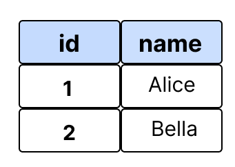
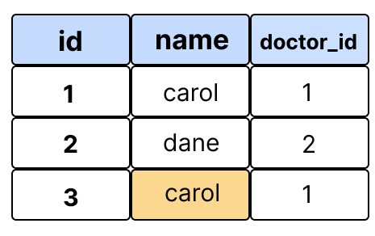
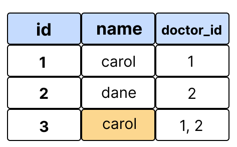
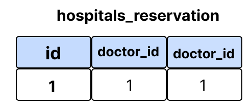

# Many to many relationship

한 테이블의 0개 이상의 레코드가 다른 테이블의 0개 이상의 레코드와 관련된다. 

양쪽 모두에서 N:1 관계를 가진다. 

## 예시) 병원 예약 시스템

만약 환자가 특정 의사의 진료 예약을 한다고 가정하였을 때 시스템이 N:1이라면,

```python
# hospitals/models.py

class Doctor(models.Model):    
    name = models.TextField()
    def __str__(self):
      return f'{self.pk}번 의사 {self.name}'

class Patient(models.Model):
    doctor = models.ForeignKey(Doctor, on_delete=models.CASCADE)
    name = models.TextField()

    def __str__(self):
       return f'{self.pk}번 환자 {self.name}'
```

이러한 모델 관계를 설정할 수 있다.  

`Patient` 클래스에서 Doctor의 클래스를 ForeignKey로 가져온다. 

`patient3 = Patient.objects.create(name='carol', doctor=doctor2)`





이때 1번 환자가 두 의사 모두 진료 예약을 하려고 한다.

두 의사를 예약하기 위해서

`patient4 = Patient.objects.create(name='carol', doctor=doctor1, doctor2)`

이러한 코드를 작성한다면, 

`SyntaxError: positional argument follows keyword argument`

두 의사 값을 한 명의 환자의 변수에 값을 넘겨줄 수 없다. 



한 명의 환자가 다른 의사를 예약하기 위해서는 또 다른 객체를 만들어야 한다. 

즉, '예약 테이블'을 만드는 것이다. 

```python
# hospitals/models.py

class Patient(models.Model):
    name = models.TextField()
    def __str__(self):
       return f'{self.pk}번 환자 {self.name}'

# 중개모델 작성
class Reservation(models.Model):
    doctor = models.ForeignKey(Doctor, on_delete=models.CASCADE)
    patient = models.ForeignKey(Patient, on_delete=models.CASCADE)

    def __str__(self):
        return f'{self.doctor_id}번 의사의 {self.patient_id}번 환자'
```

Patient 클래스의 외래키를 삭제한다. 

Reservation 클래스를 생성한다.  doctor와 patient를 외래키로 가져온다. 

```python
doctor1 = Doctor.objects.create(name='alice')
patient1 = Patient.objects.create(name='carol')  

Reservation.objects.create(doctor=doctor1, patient=patient1)
```



Reservation 테이블을 생성한 후 reservation 테이블은 이러한 형식으로 생성된다. 

Django는 ManyToManyField를 통해 중개 테이블을 자동으로 생성한다. 

# related_name

타겟 모델이 다른 모델을 참조할 때 사용한다. 

```python
class Patient(models.Model):
     doctors = models.ManyToManyField(Doctor, related_name='patients')
     name = models.TextField()

     def __str__(self):
          return f'{self.pk}번 환자 {self.name}'
```

doctors의 related_name인 patients는 Patient 클래스를 참조하기 위해 사용된다. 

# through

중개 테이블을 수동으로 지정하려는 경우 through 옵션을 사용하여 Django 모델을 지정할 수 있다. 

중개테이블에 추가 데이터를 사용하여 다대다 관계와 연결하는 경우에 사용한다. 

```python
class Patient(models.Model):
   doctors = models.ManyToManyField(Doctor, through='Reservation')
   name = models.TextField()
```

# 좋아요 기능 구현

## 0. 로직

* DB에 좋아요를 어떻게 기록할 것인지
  
  * Article(M): User(N)의 관계
  
  * Article은 0명 이상의 User에게 좋아요를 받는다.
  
  * User는 0개 이상의 글에 좋아요를 누를 수 있다.

* 로직
  
  * 상세보기 페이지에서 좋아요 링크를 누르면
  
  * '좋아요'를 DB에 추가하고 (add 메서드)
  
  * 다시 상세보기 페이지로 redirect한다.
  
  * url: /articles/<int:pk /like
    
    * user정보는 request.user에서 얻는다.

## 0-1. User - Article 간 사용 가능한 관계 정리

* article.user
  
  * 게시글을 작성한 유저 - N:1

* user.article_set
  
  * 유저가 작성한 게시글(역참조) - N:1

* article.like_users
  
  * 게시글을 좋아요한 유저 - M:N

* user.like_articles
  
  * 유저가 좋아요한 게시글(역참조) - M:N

## 1. models.py 작성

ManyToManyField를 작성한다. 

```python
# articles/models.py

class Article(models.Model):
    user = models.ForeignKey(settings.AUTH_USER_MODEL, on_delete=models.CASCADE)
    like_users = models.ManyToManyField(settings.AUTH_USER_MODEL, related_name='like_articles')
```

## 2. urls.py 작성

```python
# articles/urls.py
urlpatterns = [
    ...
    path('<int:article_pk>/likes/', views.likes, name='likes'),
]
```

## 3. views.py

```python
# articles/views.py

def likes(request, article_pk):
    article = Article.objects.get(pk=article_pk)

    if article.like_users.filter(pk=request.user.pk).exists():
    # if request.user in article.like_users.all():
       article.like_users.remove(request.user)

    else:
        article.like_users.add(request.user)

     return redirect('articles:index')
```

`exists()`는 QuerySet에 결과가 포함되어 있으면 True를 반환하고 그렇지 않으면 False를 반환한다. 

QuerySet에 있는 특정 개체의 존재와 관련된 검색할 때 유용하다. 

## 4. detail.py 작성

좋아요 버튼을 출력하도록 한다. 

```python
<!-- articles/detail.html -->



…
  
   …
   <div>
     <form action="" method="POST">
       
       
          <input type="submit" value="좋아요 취소">
       
           <input type="submit" value="좋아요">
       
      </form>
     </div>

     <a href="">DETAIL</a>
     <hr>
  

```
