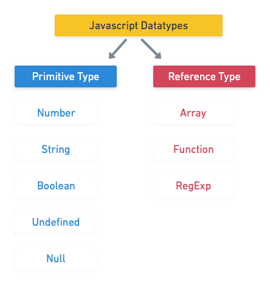

# Javascript 문법 2


### let, const

#### 재할당

- let

```js
let number = 10            // 1. 선언 및 초기값 할당
number = 10            // 2. 재할당

console.log(number)        // 10
```

let은 재할당이 가능하다. 

- const

```js
const number = 10        // 1. 선언 및 초기값
number = 10            // 2. 재할당 (불가능)
```

const는 재할당이 불가능하다.


#### 재선언

```js
let number = 10        // 1. 선언 및 초기값 할당
let nummber = 50    // 2. 재선언 (불가능)

const number = 10    // 1. 선언 및 초기값 할당
const nummber = 50    // 2. 재선언 (불가능)
```

let과 const는 재선언이 불가능하다.


### var

- 재선언 재할당이 모두 가능하다.
- 유효범위가 함수를 기준으로 하고 있다.

```js
var number = 10            // 1. 선언 및 초기값 할당
var number = 50            // 2. 재할당

console.log(number)        // 50
```

- 함수 스코프를 가지고있다.

```js
functon foo() {
    var x = 5
        console.log(x)    // 5
 }
 //ReferenceError: x is not defined
 console.log(x)
```

함수가 실행되는 범위를 뜻한다. 

함수의 중괄호 내부를 가르키며, 함수 스코프를 갖는 변수는 함수 밖에서 접근이 불가능하다. 

### 

### 호이스팅

- 변수를 선언 이전에 참조할 수 있는 현상이다. 
  - 끌어 올리는 역할
- 변수 선언 이전의 위치에서 접근 시 undefined를 반환한다. 
- let과 const도 호이스팅이 된다.
- var는 선언과 초기화가 동시에 발생한다. 
  - var는 undefined로 값을 가지고 있다.
  - let은 undefined로 초기화되지 않는다.

```js
console.log(username)    //undefined
var username = '홍길동'

console.log(email)        //Uncaught ReferenceError
let email = 'ererink@gmail.com'

console.log(age)        //Uncaught ReferenceError
let age = 50
```

|       | 재선언 | 재할당 | 스코프 | 특징  |
| ----- | --- | --- | --- | --- |
| let   | X   | O   | 블록  |     |
| const | X   | X   | 블록  |     |
| var   | O   | O   | 함수  | 사용X |


### 데이터 타입



image from jinyisland.kr

### 

### 원시 타입 Primitive type

- 정수, 문자열, Boolean 등
- 객체가 아닌 기본 타입
- 변수에 해당 타입의 값이 담긴다. 
- 다른 변수에 복사 시 실제 값이 복사된다. 

```js
let message = 'hi!'        // 1. message 선언 및 할당

let greeting = message        // 2. greeting에 message 복사
console.log(greeting)        // 3. 'hi!' 출력

message = 'hello, world!'    // 4. message 재할당
console.log(greeting)        // 5. 'hi!' 출력
```

원시타입은 실제 해당 타입의 값을 변수에 저장한다. 

### 

### 참조 타입 Reference type

- 객체 타입 
  - 배열, 함수 등
- 변수에 해당 객체의 참조 값이 담긴다. 
- 다른 변수에 복사 시 참조 값이 복사된다. 

```js
const message = ['hi!']        // 1. message 선언 및 할당

const greeting = message        // 2. greeting에 message 복사
console.log(greeting)        // 3. ['hi!'] 출력

message[0] = 'hello, world!'    // 4. message 재할당
console.log(greeting)        // 5. ['hi!'] 출력
```

참조 타입은 해당 객체를 참조할 수 있는 참조 값을 저장한다. \

### 

### 숫자

- 정수, 실수의 구분이 없는 하나의 숫자 타입이다. 
- 부동소수점 형식
- 무한대 표현 가능
- NaN (Not a Number): 산술 연산 불가
  - 'Hi there' / 5000 => NaN

### 

### 문자열

```js
const firstName = 'Erin'
const lastName = 'Kim'
const fullName = `${firstName} ${lastName}

console.log(fullName) // Erin Kim
```

- 템플릿 리터럴 Template Literal
  - 백틱으로 표현
  - ${    } 형태로 표현

### 

### undefined

- 변수의 값이 없음
- 변수 선언 이후 직접 값을 할당하지 않으면, 자동으로 undefined 할당

### 

### null

- 의도적으로 값이 없음을 표현할 때 사용한다. 

### 

### Boolean

- 조건문 또는 반복문에서 잘 사용된다. 

```js
let isAdmin = true
console.log(isAdmin)     //true

isAdmin = false
console.log(isAdmin)     //false
```

### 

### 동등 비교 연산자 (==)

- 피연산자가 같은 값으로 평가되는지 비교 후 boolean 값을 반환한다.
- 피연산자가 모두 객체일 경우 메모리의 같은 객체를 바라보는지 판별한다.
- 예상치 못한 결과가 발생할 수 있으므로 잘 사용하지 않는다!

```js
const a = 1004
const b = '1004'
console.log(a == b)    // true

const c = 1
const d = true
console.log(c == d)    // true
```

### 

### 일치 비교 연산자 (===)

- 피연산자가 같은 값으로 평가되는지 비교 후 boolean 값을 반환한다.

```js
const a = 1004
const b = '1004'
console.log(a === b)    // false

const c = 1
const d = true
console.log(c === d)    // false
```

### 

### 논리 연산자

- and: &&
- or: ||
- not: !
- 단축도 가능
  - false && true => false
  - ture || false => true

### 

### 삼항 연산자 (Ternary Operator)

- 세 개의 피연산자를 사용하여 조건에 따라 값을 반환하는 연산자
- 가장 왼쪽의 조건식이 참이면 **콜론(:) 앞의 값**을 사용하고 그렇지 않으면 **콜론(:) 뒤의 값**을 사용
- 변수에 할당 가능하다.
- 한 줄에 표기하는 것을 권장!

```js
console.log(true ? 1 : 2)        // 1
console.log(false ? 1 : 2)        // 2

const result = Math.PI > 4 ? 'Yes' : 'No'
console.log(result)            // No
```


