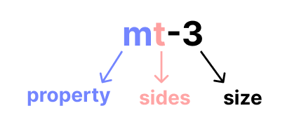
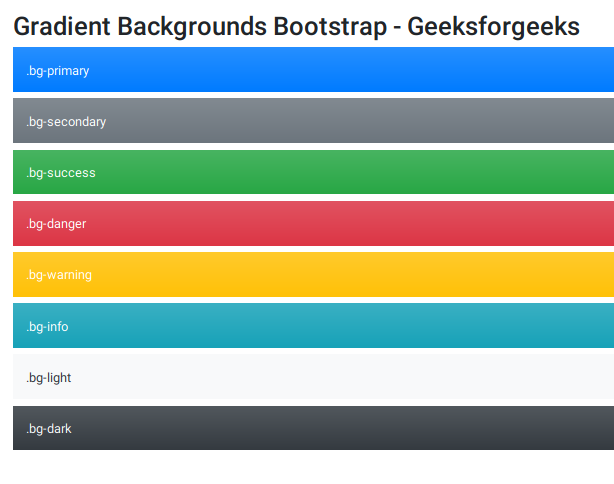

# form

* 데이터를 서버에 제출하기 위해 사용하는 태그이다. 

* 기본 속성
  
  * action: form을 처리할 서버의 URL
    
    * search, 
  
  * method: : form을 제출할 때 사용할 HTTP 메서드
    
    * GET, POST, DIALOG
  
  * enctype: method가 post인 경우 데이터의 유형

```html
<form action="/search" method="GET" class="form-example">
</form>
```

# input

* 입력 데이터 유형과 위젯이 제공된다.

* 입력칸 생성
  
  * name
  
  * value
  
  * required, readonly, autofocus, autocomplete, disabled 등

```html
<form action="/search" method="GET">
    <input type="text" name="q">
</form>
```

## input label

* label을 클릭하여 input(입력란)에 초점을 맞추거나 활성화 시킬 수 있다. 

```html
<label for="agreement">User name: </label>
<input type="checkbox" name="agreement" id="agreement">
```

즉, 화면에 보이는 'User name' 텍스트를  클릭하여도 입력칸(input) 혹은 선택란에 선택이 가능하도록 하는 것이다. 

label 사용 시 input의 id와 label for를 연결해야 한다. (같은 값 작성)

**Value(값)이 name(이름)으로 매핑되어 서버에 전송하는 것이다.**

## input 유형

* 각 해당 유형이 아닐 시 유형에 맞는 input을 입력하도록 메세지를 띄운다. 
  
  * text
  
  * password
  
  * email
  
  * number
  
  * file

* 선택 항목
  
  * checkbox
  
  * radio

```html
<input id="html" type="checkbox" name="language" value="html">
```

# Bootstrap

CDN links를 불러온다.

```html
<link href="https://cdn.jsdelivr.net/npm/bootstrap@5.2.0/dist/css/bootstrap.min.css" rel="stylesheet" integrity="sha384-gH2yIJqKdNHPEq0n4Mqa/HGKIhSkIHeL5AyhkYV8i59U5AR6csBvApHHNl/vI1Bx" crossorigin="anonymous">
```

## spacing



```html
<div class="mt-3 ms-5">bootstrap-spacing</div>
```

### property

* m
  
  * margin
    
    * m-1 = 0.25rem = 4px
    
    * m-2 = 0.5rem = 8px
    
    * m-3 = 1rem = 16px
    
    * m-4 = 1.5rem = 24px
    
    * m-5 = 3rem =48px

* p
  
  * padding

### sides

* t
  
  * margin-top, padding-top 

* b
  
  * margin-bottom, padding-bottom

* s (start)
  
  * side
    
    * margin- left, margin-right
    
    * padding-left, padding-right

* e (end)
  
  * margin- left, margin-right
  
  * padding-left, padding-right

* x
  
  * left, right

* y
  
  * top, bottom

## color



(image from GeeksforGeeks)

배경과 폰트 색을 지정해준다. 


```html
<h2>Color</h2>
<div class="bg-primary">파랑</div>
<div class="bg-secondary">회색</div>
<div class="bg-danger">빨강</div>
<p class="text-success">초록색 글씨</p>
<p class="text-danger">빨간색 글씨</p>
```


# Text

#### Text alignment

- text-start

- text-center

- text-end

- fw-bold

## Font size

* fs-1, fs-2, etc

## Font weight and italics

* fw-normal

* fw-light

* fst-italic


# Display

* display: inline

```html
<div class="d-inline p-2 text-bg-primary">d-inline</div>

```

* d-print-inline-block

* d-print-block


# Flex

#### 기본 형식

```html
<div class="d-flex"></div>
```


### flex-row

```html
<div class="d-flex flex-row mb-3">
  <div class="p-2">Flex item 1</div>
  <div class="p-2">Flex item 2</div>
  <div class="p-2">Flex item 3</div>
</div>
```

3개의 item들을 좌측 정렬한다. 


#### flex-column

```html
<div class="d-flex flex-column mb-3">
  <div class="p-2">Flex item 1</div>
  <div class="p-2">Flex item 2</div>
  <div class="p-2">Flex item 3</div>
</div>
```

3개의 item들을 세로로 정렬한다. 


#### Justify content

```html
<div class="d-flex justify-content-start">...</div>
<div class="d-flex justify-content-end">...</div>
<div class="d-flex justify-content-center">...</div>
<div class="d-flex justify-content-between">...</div>
<div class="d-flex justify-content-around">...</div>
<div class="d-flex justify-content-evenly">...</div>
```


#### Align items

```html
<div class="d-flex align-items-start">...</div>
<div class="d-flex align-items-end">...</div>
<div class="d-flex align-items-center">...</div>
<div class="d-flex align-items-baseline">...</div>
<div class="d-flex align-items-stretch">...</div>
```


#### Grow and shrink

```html
<div class="d-flex">
  <div class="p-2 flex-grow-1">Flex item</div>
  <div class="p-2">Flex item</div>
  <div class="p-2">Third flex item</div>
</div>
```

화면을 꽉 채운 좌측 정렬 구성이다.


#### Wrap

```html
<div class="d-flex flex-wrap">
  ...
</div>
```
